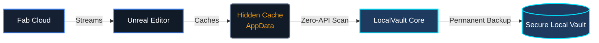

# 🛡️ LocalVault Core

 

 

**LocalVault Core** is an essential, open-source utility plugin for Unreal Engine 5 that bridges the gap between Epic's cloud-based Fab ecosystem and your local offline development environment. 

By running a fast, local-first cache scan (Zero-API strategy), LocalVault Core gives you back ownership of your downloaded assets. Tag, filter, and permanently back up your 3D models, materials, and VFX—all without leaving the Editor.

 

## 🎯 Why LocalVault?

With the transition to the **Fab** ecosystem, asset delivery is increasingly "on-demand," streaming directly into obscured AppData cache directories (`FFabAssetsCache`). If you need to work offline, migrate libraries to a NAS, or simply want to guarantee asset permanence, you need a local backup.

**LocalVault Core** solves this by safely hooking into the engine's cache pipeline, giving you a beautiful, offline-ready interface to manage what you own.

 

## ✨ Core Features

* 📦 **True Offline Backups:** Extract your cached Fab assets directly to a secure, permanent directory on your hard drive. Ensure your environment megapacks and MetaHumans are safe forever.
* 🏷️ **Persistent Tagging:** Apply custom metadata directly to your assets. Group by genre, project, or utility and instantly filter them without internet latency.
* 🔒 **Zero-API Security:** LocalVault natively scans the engine's local cache. No Epic login required, no OAuth, and no internet connection needed once assets are downloaded.

 

## 🚀 Installation & Setup

1. **Clone or Download** the LocalVault repository.
2. **Copy** the `LocalVault` folder into your project's `Plugins` directory (e.g., `[YourProject]/Plugins/LocalVault`).
3. **Generate Visual Studio project files** (if it's a C++ project) and recompile, or simply open your Blueprint project and allow the engine to build the plugin.
4. **Configure Storage:**
   - Go to `Edit > Project Settings`.
   - Scroll down to the `Plugins` section and select `LocalVault`.
   - Set your **Local Vault Storage Path** to a high-capacity directory (e.g., `D:\UnrealVaultArchive`).

 

## 📖 How to Use

1. **Download Assets from Fab:** Open the official Epic Fab window inside Unreal Engine 5 and download your desired assets.
2. **Open LocalVault:** Go to `Window > Asset Management > LocalVault Browser`.
3. **Sync:** Click the **Sync with Epic** button. LocalVault will automatically index your `FFabAssetsCache`.
4. **Organize:** Select assets and apply offline tags.
5. **Backup:** Select your assets and click **Download Assets** to execute a deep, multi-threaded directory copy into your permanent storage path.

 

## 💎 LocalVault Pro

LocalVault Core provides everything you need to start securing your Fab library. For advanced enterprise features, including **Multi-User Network Support**, **Automated Nightly Backups**, **Advanced Search Syntax**, and **Direct Project Injection**, upgrade to **[LocalVault Pro on Fab.com](https://www.fab.com/sellers/GregOrigin)**. 

Purchasing the Pro version directly supports the continuous development of these tools!

 

## 🛠️ Architecture Flow

 

## 🙋‍♂️ Support & Troubleshooting

If you click "Sync" and see **0 assets found**, it means your `FFabAssetsCache` is empty. You must download the asset through the official Unreal Editor Fab window at least once for LocalVault to see it.

If backups fail, ensure your Storage Path isn't exceeding Windows' 260-character `MAX_PATH` limit, and ensure you have enough free drive space.

---

  <b>Built by Andras Gregori at <a href="https://gregorigin.com">GregOrigin</a></b> 
  <i>"Building tools that empower creators to shape worlds."</i>

